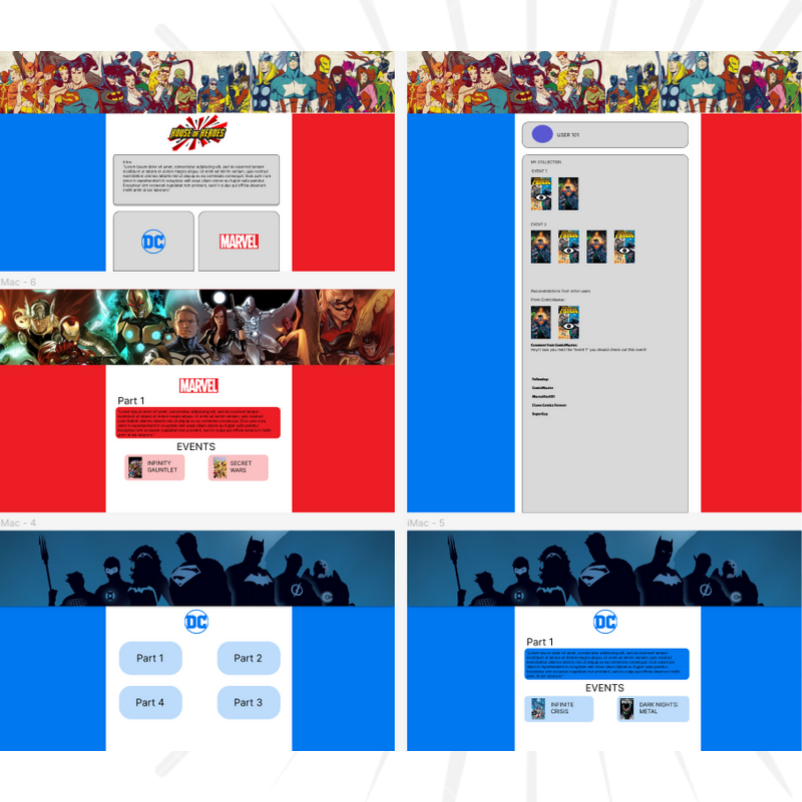

# Project's name

## Description

This is an application developed by Alberto Quintero as the final project for the 3rd module of Ironhack Barcelona. The app is a great place for new and experience people in the comics world. 

> Add a picture (logo, design, actual screen, gif, etc, whichever you prefer.)


---
## Instructions

When cloning the project, change the <code>sample.env</code> file name for <code>.env</code>. The project will run on **PORT 3000**.

Then, run:
```bash
npm install
```

To start the project run:
```bash
npm run start
```

---
## User stories 

### MVP

- User can sign up and create a new account
- User can login
- User can log out
- User can Edit his profile
- User can edit collections
- User can create, edit or delete issues, events and parts

### Backlog

- User can change his/her profile picture
- User can Store collections in his/her profile


---

## Useful links

- [Presentation slides](https://slides.com/albertoquintero-1/deck)
- [Backend repository](https://github.com/Betoquintero/back-HouseOfHeroes.git)
- [Backend deploy](https://house-of-heroes.herokuapp.com/)
- [Deployed app](https://house-of-heroes.netlify.app/)


